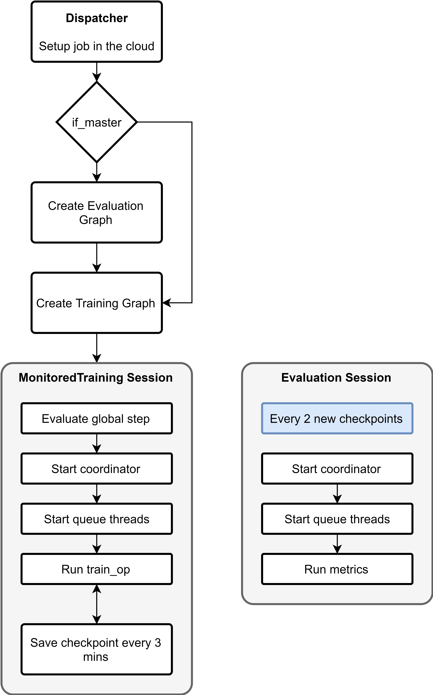
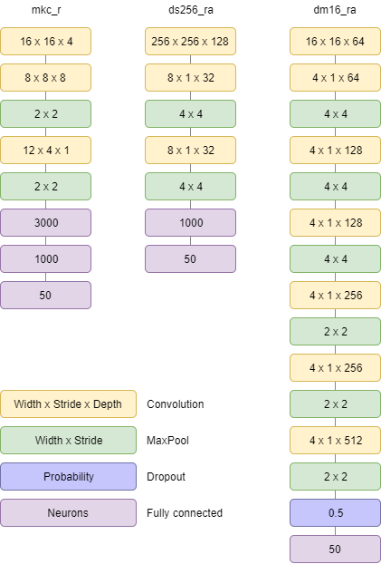

# Automatic Music Tagging using Convolutional Neural Networks

This repository contains all the code, documentation, and logs of the project regarding using convolutional nueral networks to automatically tag music. This is an MSc dissertation project at the University of Edinbrugh, partly also subsidised by Malta's Endeavour scholarship scheme 2016-2017.

Author: Mark Cutajar  
Email: mcut94@gmail.com / markc@gummymelon.com

Superviser: Professor Steve Renals  
School of Informatics  
University of Edinburgh

Package dependencies:
1. Python 2.7 (or 3.5, however Cloud SDK requires python 2.7 to run)
2. Tensorflow
3. Cloud SDK
4. pydub
5. ffmpeg
6. python_speech_features

 Files and folder description:
<ul>
<li>cloud: Contains all the run scripts. Each test has a bash run script depen_ding on the test. Some tests have both _mgpu_ runscripts which run the test on GPUs instead a cluster of CPUs. Others also have a _restore_ file to continue run from previous checkpoint keeping the same google storage save directory as before.</li>
<li>cloud/trainer: Contains all the python files for running the tests.</li>
<li>cloud/trainer/models.py or models_mgpu.py**: The python files with the models being run for both GPU setup and cluster setup. </li>
<li>cloud/trainer/task.py or task_mgpu.py**: The training python scripts to create the cluster and setup the servers, train, handle checkpoints, summaries and evaluation.</li>
<li>notebooks: Folder with some preliminary testing scripts when setting up the framework.</li>
<li>pydst: Folder with scripts of extracting the dataset and saving as records.</li>
<li>pydst/extract_ds_tfr.py: Extract file and save raw format in tfrecord.</li>
<li>pydst/extract_ds_fbanks_tfr.py: Extract file and save fbanks format in tfrecord.</li>
<li>pydst/extract_dsw_tfr.py: Extract file and save windowed raw format in tfrecord.</li>
<li>pydst/extract_dsw_fbanks_tfr.py: Extract file and save windowed fbanks format in tfrecord.</li>
<li>testInfo_and_results.xlsx: All the results and models used in the this research.</li>
</ul>
  
### Research proposal abstract

Online databases have grown to a size that are unmanageable without automatic tagging systems. This has incited interest in the field of automatic music classification. Recently, there has been a shift towards music tagging models making use of convolutional networks working upon raw waveforms. Even though raw waveforms have more information, in recent studies the spectrogram state-of-the-art is still not surpassed by any of the raw waveform models. This study aims to construct a number of the best performing raw-waveform models such as exclusively convolutional and convolutional recurrent models, and analyse the different feature maps. These feature maps will be investigated by listening to the extracted audio and comparing the audio to the ones of other models. Furthermore, extraction of the frequency spectrum of the different maps enables the construction of the filters of each stage by comparison to the previous level. Secondary objectives include construction of deeper networks, and making use of techniques such as residual learning and stochastic pooling. Thus, the secondary objective aims to find a model which is better than the state-of-the-art. The qualitative analysis of this study would not only aid researchers when constructing models for music classification and time-series classification, but also developers in the commercial scenario in order to construct models for music database management and recommendation systems. 
  

### Problem definition

Even though Raw data as input is becoming more common in recent studies; there seems to be no consistency with regarding to kernel size, kernel shape, and windowing techniques. The aim of this project was to investigate windowing techniques such as splitting and superpooling, kernel sizes, dilation in kernels and the use of multiple kernels.

### Datasets considered

The main dataset considered for this project is the MagnaTagATune dataset. This dataset was presented by Law et al. [1]. MagnaTagATune has 25,863 tracks from 230 different artists and 188 tags. Only the top 50 tags are normally used for the task. The audio is available in mp3 format. Since only 230 different artists are present in this dataset, it lacks variety; however, it is used extensively and a good option to use to compare to other literature. More issues with this dataset include the quality of annotations and the tag balancing. The ration between the most frequent and the 50th tag is 9:1. Furthermore, the top 50 annotations include tags such as female, woman, and female voice which are multiples of the same thing. This makes it more difficult for the network to learn. An option would be to merge these tags together; however, once again this would make the results not comparable to other literature. 

An alternative was the Million song dataset presented by Bertin-Mahieux et al. [2]. This has much more variety with more than three million songs. Since the dataset is so large, this would take a considerable amount of time to process. For the time scale of this project, this is not an ideal dataset. Tests would take longer to train and validate, and would require more memory. An option would be to create a balanced subset from this dataset, however, that would still require to acquire the dataset which ranges in Terabytes and process it to acquire a balanced set. Once again this was deemed unfeasible. 

The final alternative was the newly setup FMA dataset [3]. This dataset has about 106,574 tracks from 16,341 different artists whilst also having audio available. This has more variety in the artists and the songs; the variety could aid the network generalize better. However, in this case specific tags apart from the genre, era and artist name are not available. Attempts to acquire the corresponding tags from the Last.FM API were mostly unsuccessful. The script designed, for each song would send an API request to Last.FM for the tags of the specific song. However, a large number of songs were not tagged by the general public. Moreover, since this dataset is relatively new and presented just in 2017, comparison to literature would be limited. 

Due to the issues with the latter two datasets, the MagnaTagATune dataset was deemed most appropriate, both due to the manageable size, tag availability and comparability. 

[1] E. Law, K. West, M. Mandel, M. Bay, and J. S. Downie, “Evaluation of Algorithms using Games: The case of Music Tagging,” in ISMIR, 2009. 
[2]	T. Beretin-Mahieux, D. P. W. Ellis, P. Lamere, and B. Whitman, “The Million Song Dataset,” in 12th International Society for Music Information Retrieval Conference, 2011. 
[3]	M. Defferrard, K. Benzi, P. Vandergheynst, and X. Bresson, “FMA: A Dataset for Music Analysis,” url: https://arxiv.org/pdf/1612.01840.pdf. 

### Framework

This project will make use of Tensorflow Python API v1.2 and Cloud SDK. The models are first tested on the local environment and then exported to be trained on Cloud ML. The models are trained in either distributed manner or using GPUs in order to minimize the computational time and hence larger networks can be used. 

As much as possible the low level API shall be used with some minor exceptions. This is done so the graph can be customised as much as needed for the different tests.

The main script, irrespecitve if a cluster or GPUs are used are trained using the same script structure. First a function dispatches the function on the cloud. If the machine running the function is the master node, an evalution graph is setup together with the training graph, else only the training graph. The general diagram for this script is shown in the figure below.

The only difference between the cluster setup and the multi-GPU setup is that in the multi-GPU setup, the gradients are computed seperately on the differnet GPUs and then concatenated and applied using the CPU. This is explained extensively <a href="https://www.tensorflow.org/tutorials/deep_cnn">here</a>. The distributed setup is briefly explained <a href="https://www.tensorflow.org/deploy/distributed">here</a>.

The raw models that were used in this project are shown below. These are only the basic ones. Especially when testing diluted layers or multiple kernels these were modified for the respective test.

### Important test results

### Future work

*To be continued...*

